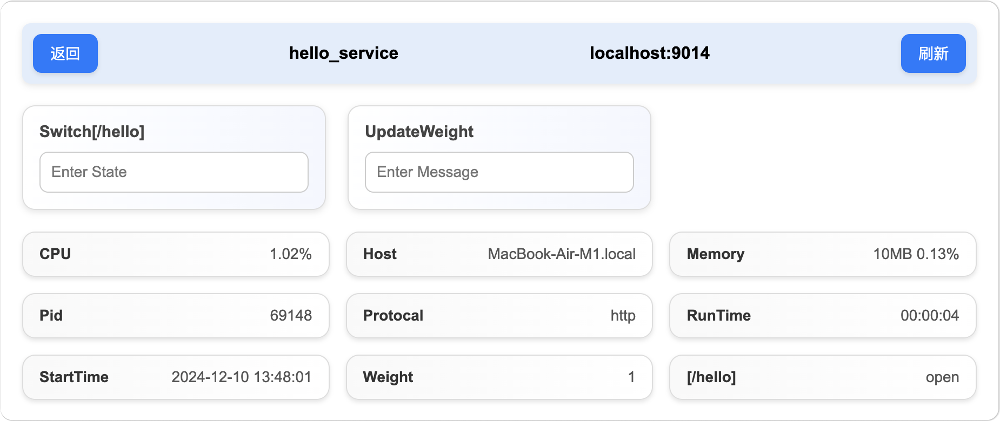

# 简介
## 什么是 OMI？
OMI 是一款用于搭建全栈微服务的框架，它基于 Go 和 Redis 开发，提供了一套搭建前后端微服务和调用远程服务的方法，能够帮助开发人员高效地搭建微服务项目。
## 为什么选择 OMI？
### 1. 基于 Redis 搭建注册中心
基于几乎每个项目都会使用的 Redis 搭建注册中心，无需专门的注册中心中间件，降低了架构复杂度，同时降低了学习成本和使用成本。
```
stormi:server:hello_service:localhost:9014
```
所有服务采用如上形式注册到 Reids 上，以 "stormi:server:[服务名]:[地址]" 作为 Key 存储注册信息。
### 2. 使用 RESTful 风格调用远程服务
前后端均采用 RESTful 风格调用远程服务，这种风格的统一使得远程调用的学习和使用几乎没有学习成本。
```go
import	omi "github.com/stormi-li/omiv1"

var RedisAddr = "localhost:6379"

func main() {
	options := &omi.Options{Addr: RedisAddr}

	omiClient := omi.NewClient(options)

	p := &Person{Name: "stormi-li"}

	response, err := omiClient.Call("server_demo", "/hello", p)
	if err == nil {
		response.Read(p)
	}
}

type Person struct {
	Name string
}
```
如上述代码所示，远程服务的调用```Call("server_demo", "/hello", p)```采用服务名+资源路径+数据的形式，延续了 RESTful 风格。
### 3. 完善的服务监控和管理功能
OMI 框架自带服务监控和管理功能，能够监控和管理每一个微服务，并且能够精确到每一个路由。



如上图所示，OMI 原生自带的服务监控管理功能能够监控微服务的各项信息如 CPU 占用和内存的占用等，同时还提供了一系列扩展方法，开发人员可以自定义监控信息。不仅如此，开发人员还可以远程管理微服务，比如修改微服务权重，或者禁用某个路由，同样的，管理服务也可以由开发人员自定义。
# 快速上手

## 安装
go 版本 >= 1.22.4
```go
go get github.com/stormi-li/omiv1
```
## 启动 Redis
在使用后续功能前你需要先启动一个 Redis 实例，并且当前只支持 Redis 单例模式。建议新建一个 Redis 实例专门用于搭建注册中心，防止 Key 冲突。如果要进行服务隔离可以用 DB 区分，或者使用其它 Redis 实例。在这里我们假设你已经启动了一个 Redis 实例，并且默认 Addr:"localhost:6379"，Password:""， DB:0
## 启动 Monitor 
代码：
```go
import omi "github.com/stormi-li/omiv1"

var RedisAddr = "localhost:6379"

func main() {
	omiClient := omi.NewClient(&omi.Options{Addr: RedisAddr})
	monitorMux := omiClient.NewMonitorMux()
	omiClient.RegisterAndServe("monitor", "localhost:9013", monitorMux)
}
```
在浏览器输入：
```
http://localhost:9013
```
如果成功跳转到页面表示 Monitor 服务启动成功，并且已在 Redis 上注册。

# 配置项
```go
type Options struct {
	// redis服务器地址，ip:port格式，比如：192.168.1.100:6379
	// 默认为 :6379
	Addr string
	// 默认为空，不进行认证。
	Password string
	// redis DB 数据库，默认为0
	DB int
	// 本地缓存路径，默认为不启用缓存
	CacheDir string
	// redis配置项，优先使用
	RedisOptions *redis.Options
}
```
# 创建一个域名代理服务
代码：
```go
import (
	"net/http"

	omi "github.com/stormi-li/omiv1"
	"github.com/stormi-li/omiv1/omihttp"
)

var RedisAddr = "localhost:6379"

func main() {
	options := &omi.Options{
		Addr:     RedisAddr,
		Password: "",
		DB:       0,
		CacheDir: "cache", //启用缓存，缓存路径为“cache”
	}

	omiClient := omi.NewClient(options)

	mux := omiClient.NewServeMux()

	mux.HandleFunc("/", func(w http.ResponseWriter, r *http.Request, rw *omihttp.ReadWriter) {
		omiClient.ServeDomainProxy(w, r) //域名代理，解析域名，并将请求转发
	})

	omiClient.RegisterAndServe("http-80代理", "localhost:80", mux) //注册并启动代理服务，代理80端口
}
```
# 创建一个 Web 服务
生成模版代码：
```go
import omi "github.com/stormi-li/omiv1"

var RedisAddr = "localhost:6379"

func main() {

	options := &omi.Options{Addr: RedisAddr}

	omiClient := omi.NewClient(options)
	web := omiClient.NewWebServer(nil)
	web.GenerateTemplate() //生成模版代码
}
```
启动代码：
```go
import (
	"net/http"

	omi "github.com/stormi-li/omiv1"
	"github.com/stormi-li/omiv1/omihttp"
)

var RedisAddr = "localhost:6379"

func main() {

	options := &omi.Options{Addr: RedisAddr}

	omiClient := omi.NewClient(options)
	web := omiClient.NewWebServer(nil)
	mux := omiClient.NewServeMux()

	mux.HandleFunc("/", func(w http.ResponseWriter, r *http.Request, rw *omihttp.ReadWriter) {
		web.ServeWeb(w, r)
	})

	omiClient.RegisterAndServe("localhost", "localhost:8080", mux)
}
```
浏览器输入：
```
http://localhost
```
# 启动路径代理服务
代码：
```go
import (
	"net/http"

	omi "github.com/stormi-li/omiv1"
	"github.com/stormi-li/omiv1/omihttp"
)

var RedisAddr = "localhost:6379"

func main() {

	options := &omi.Options{Addr: RedisAddr}

	omiClient := omi.NewClient(options)
	web := omiClient.NewWebServer(nil)
	mux := omiClient.NewServeMux()

	mux.HandleFunc("/", func(w http.ResponseWriter, r *http.Request, rw *omihttp.ReadWriter) {
		if web.ServeWeb(w, r) {
			return
		}
		omiClient.ServePathProxy(w, r) //启动路径代理服务
	})

	omiClient.RegisterAndServe("localhost", "localhost:8080", mux)
}
```
# 创建后端微服务
http：
```go
import (
	"fmt"
	"net/http"

	omi "github.com/stormi-li/omiv1"
	"github.com/stormi-li/omiv1/omihttp"
)

var RedisAddr = "localhost:6379"

func main() {
	options := &omi.Options{Addr: RedisAddr}

	omiClient := omi.NewClient(options)
	mux := omiClient.NewServeMux()

	mux.HandleFunc("/http/hello", func(w http.ResponseWriter, r *http.Request, rw *omihttp.ReadWriter) {
		fmt.Fprintf(w, "hello, send by http")

	})

	omiClient.RegisterAndServe("http_hello_service", "localhost:9014", mux)
}
```
websocket:
```go
import (
	"net/http"
	"time"

	"github.com/gorilla/websocket"
	omi "github.com/stormi-li/omiv1"
	"github.com/stormi-li/omiv1/omihttp"
)

var RedisAddr = "localhost:6379"

func main() {
	options := &omi.Options{Addr: RedisAddr}

	omiClient := omi.NewClient(options)
	mux := omiClient.NewServeMux()

	mux.HandleFunc("/hello", func(w http.ResponseWriter, r *http.Request, rw *omihttp.ReadWriter) {
		upgrader := websocket.Upgrader{}
		c, _ := upgrader.Upgrade(w, r, nil)
		c.WriteMessage(1, []byte("hello, send by websocket"))
		time.Sleep(100 * time.Millisecond)
		c.Close()
	})

	omiClient.RegisterAndServe("websocket_hello_service", "localhost:9015", mux)
}
```
在```localhost```测试
```
http_hello_service/hello
websocket_hello_service/hello
```
# 使用远程调用服务
服务端(json)：
```go
import (
	"net/http"

	omi "github.com/stormi-li/omiv1"
	"github.com/stormi-li/omiv1/omihttp"
)

var RedisAddr = "localhost:6379"

func main() {
	options := &omi.Options{Addr: RedisAddr}

	c := omi.NewClient(options)
	mux := c.NewServeMux()

	mux.HandleFunc("/hello", func(w http.ResponseWriter, r *http.Request, rw *omihttp.ReadWriter) {
		p := Person{}
		err := rw.Read(&p)
		if err == nil {
			p.Name = "hello " + p.Name
			rw.Write(&p)
		}
	})
	c.RegisterAndServe("rpc_hello", "localhost:9015", mux)
}

type Person struct {
	Name string
}
```
客户端(json)：
```go
import (
	"fmt"

	omi "github.com/stormi-li/omiv1"
)

var RedisAddr = "localhost:6379"

func main() {
	options := &omi.Options{Addr: RedisAddr}

	omiClient := omi.NewClient(options)

	p := Person{Name: "stormi-li"}

	response, err := omiClient.Post("rpc_hello", "/hello", &p)
	if err == nil {
		response.Read(&p)
		fmt.Println(p.Name)
	}
}

type Person struct {
	Name string
}
```
# 启用 TLS 
生成测试证书和私钥：
```go
import omi "github.com/stormi-li/omiv1"

var RedisAddr = "localhost:6379"

func main() {
	options := &omi.Options{Addr: RedisAddr}

	c := omi.NewClient(options)
	c.GenerateTestCertAndKey()
}
```
服务端：
```go
import (
	"net/http"

	omi "github.com/stormi-li/omiv1"
	"github.com/stormi-li/omiv1/omihttp"
)

var RedisAddr = "localhost:6379"

func main() {
	options := &omi.Options{Addr: RedisAddr}

	c := omi.NewClient(options)
	mux := c.NewServeMux()

	mux.HandleFunc("/hello", func(w http.ResponseWriter, r *http.Request, rw *omihttp.ReadWriter) {
		p := Person{}
		err := rw.Read(&p)
		if err == nil {
			p.Name = "hello " + p.Name
			rw.Write(&p)
		}
	})
	c.RegisterAndServeTLS("rpc_hello", "localhost:9015", "server.crt", "server.key", mux)
}

type Person struct {
	Name string
}
```
客户端：
```go
import (
	"crypto/tls"
	"fmt"
	"net/http"

	omi "github.com/stormi-li/omiv1"
)

var RedisAddr = "localhost:6379"

func main() {
	options := &omi.Options{Addr: RedisAddr}

	omiClient := omi.NewClient(options)
	omiClient.SetTransport(&http.Transport{
		TLSClientConfig: &tls.Config{
			InsecureSkipVerify: true,
		},
	})

	p := Person{Name: "stormi-li"}

	response, err := omiClient.Post("rpc_hello", "/hello", &p)
	if err == nil {
		response.Read(&p)
		fmt.Println(p.Name)
	}
}

type Person struct {
	Name string
}
```
